#python+django后端：
    Github地址：https://github.com/wangyinghaotest/TestPlatformDjango
# VueAutomatedTestPlatform
#前端Vue-测试平台
    下载后运行npm install 如异常报错，
    运行如下命令：
    npm config set strict-ssl false
    然后再运行 npm install

#项目页面
#首页
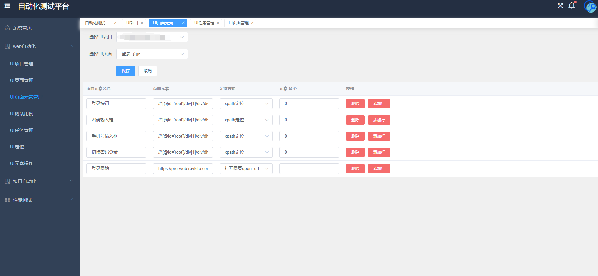

#Web自动化

页面元素管理
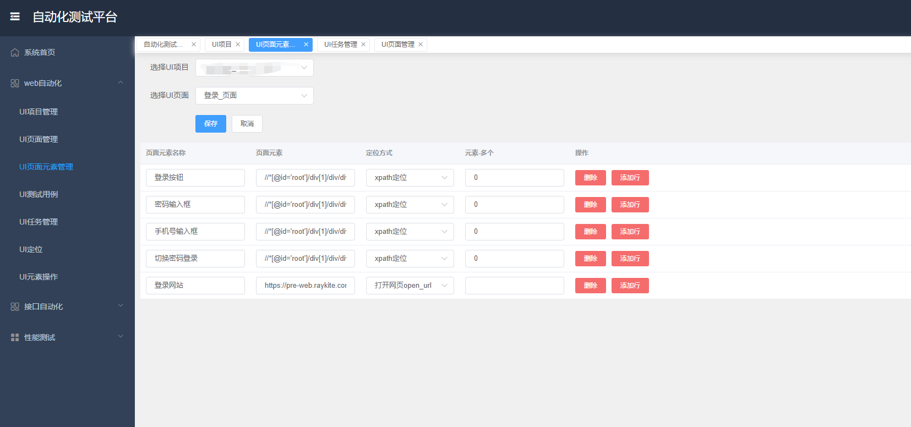

测试报告
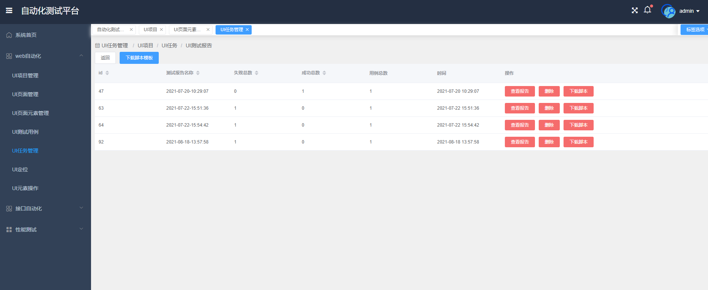

测试报告详情
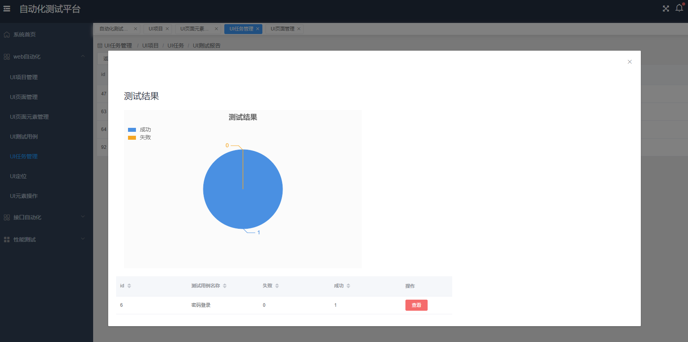

UI定位
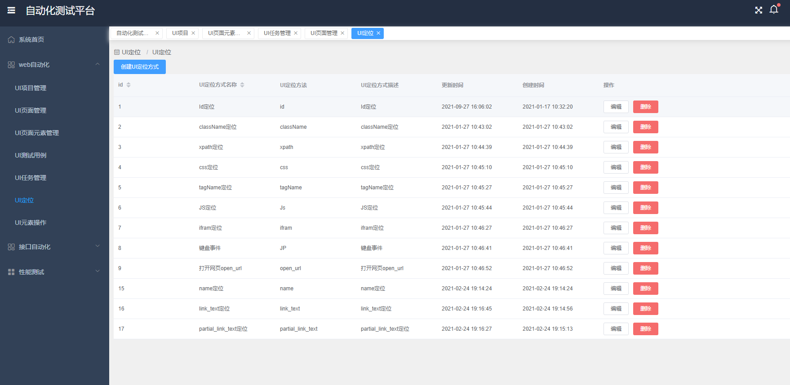

UI元素操作
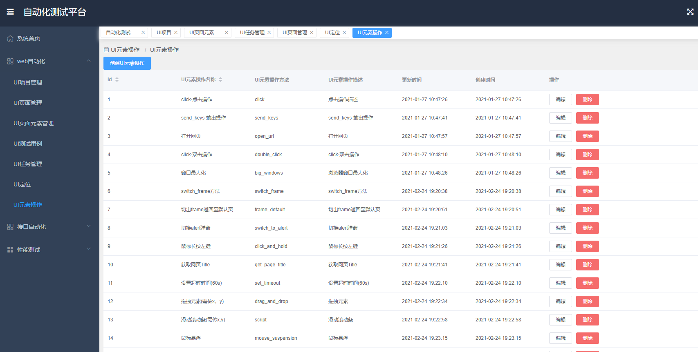

#接口自动化
API测试用例
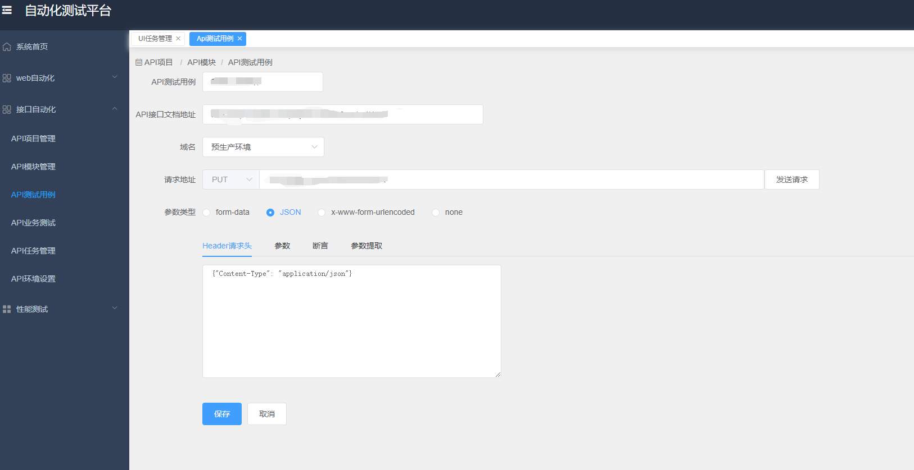

API测试用例-发送请求
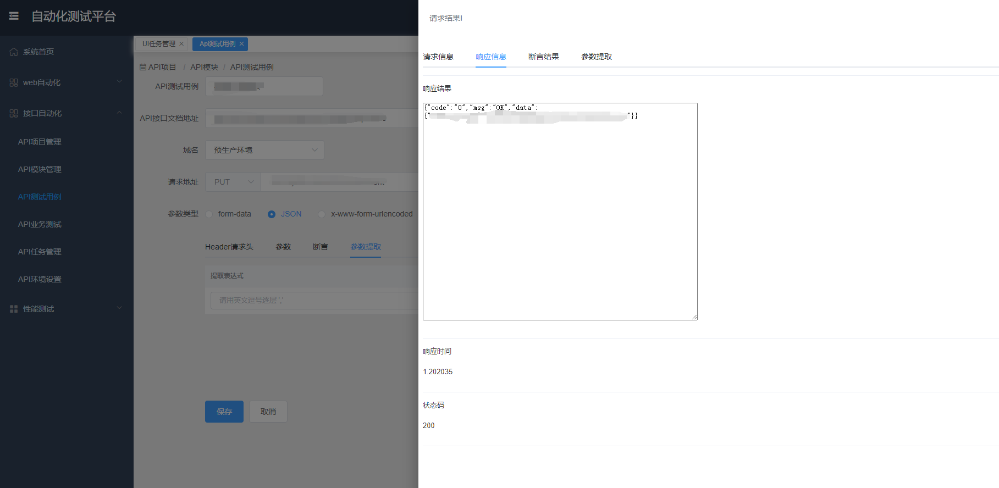

API业务测试用例
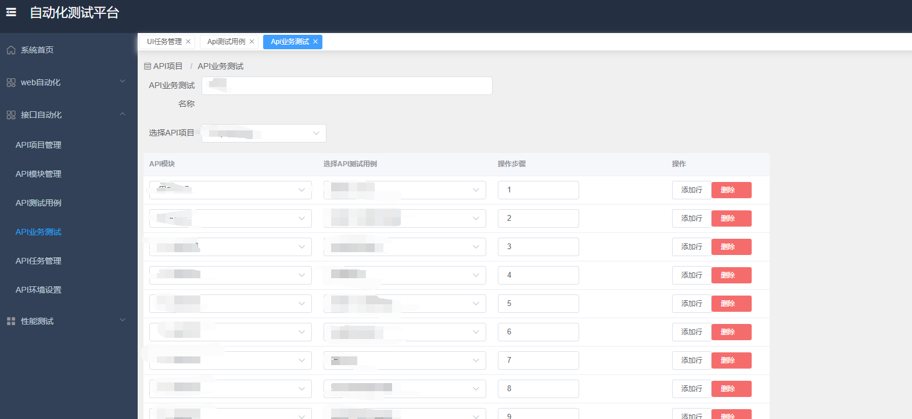

API测试报告
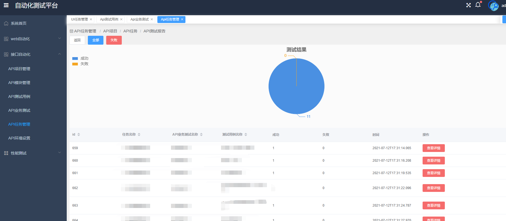

API测试报告详情
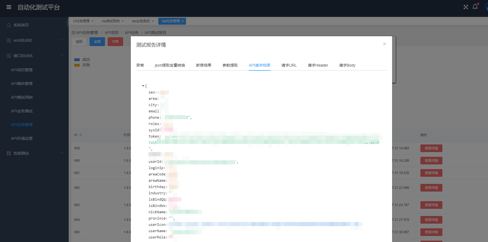

#性能测试
性能测试脚本页面
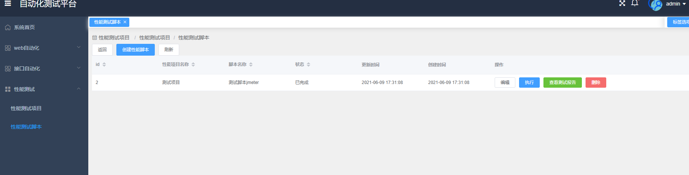

性能测试脚本
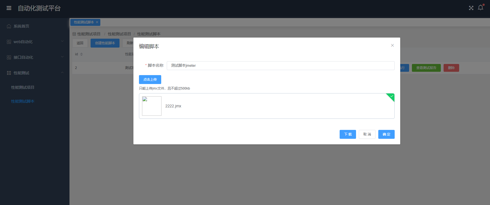
